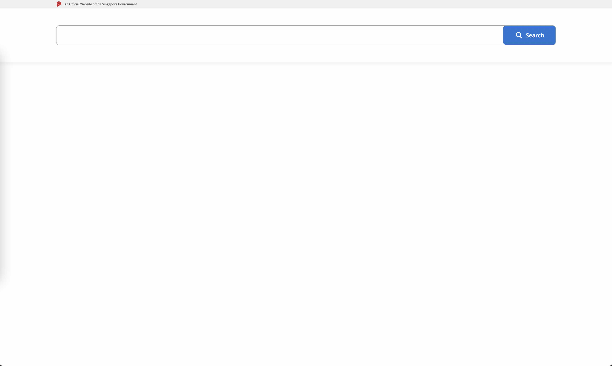
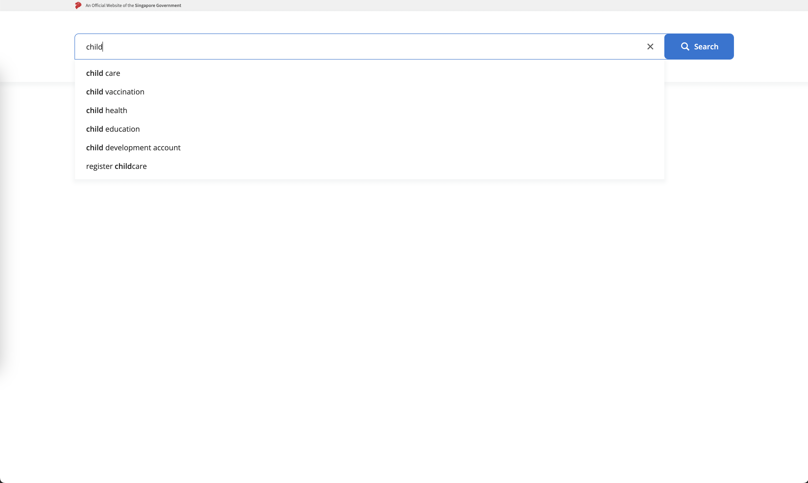

# Overview

This project, 'Searching Website', is a web application designed to provide search function to user and display the results with highlighted words

# Table of contents

- [Overview](#overview)
- [Approach](#approach)
- [Libraries](#libraries)
- [Installation](#installation)
  - [Run the App](#run-the-app)
  - [Run Tests](#run-tests)
- [Production URL](#production-url)
- [Usecases](#usecases)

# Approach

In this project, since the API endpoints return static responses, all filtering and search functionalities are handled entirely on the frontend. When users search or apply filters, the client processes the static data fetched from the server by matching it against the search keyword or filter criteria.

- Filter the search results to include only items with titles containing the search term, ignoring case sensitivity.
- Provide search suggestions that contain the search term within the suggestion content, maintaining case sensitivity.

# Libraries

- Typescript: TypeScript is a language for application-scale JavaScript
- React: React is the library for web and native user interfaces.
- Jest: A testing framework for javascript applications.
- Tailwindcss: A utility-first CSS framework for rapidly building custom user interfaces.

# Installation

To install and run this project on your local machine, follow these steps:

1. Clone the repository

   ```bash
   git clone https://github.com/luongngocsontung/search-demo.git
   cd search-demo
   ```

2. Install dependencies

   ```bash
    npm install
   ```

## Run the App

1. Run command

   ```bash
   npm run dev
   ```

2. Open your browser and go to http://localhost:5173

## Run Tests

```bash
npm run test
```

## Production URL

https://search-tung.netlify.app/

## Usecases

- Search for a specific term in the search bar

  

- Show search suggestions when typing in the search bar

  

- Show search results after hitting enter or clicking the search button

  
